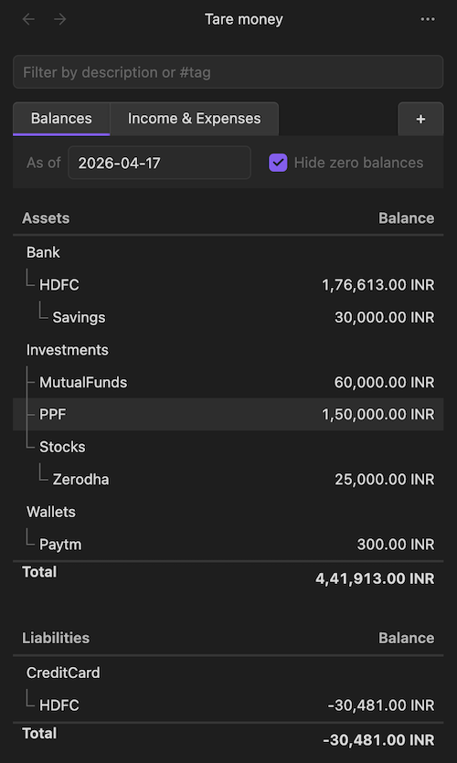

# Tare Money

> A local-first, plain-text money tracker for Obsidian.

A plain-text accounting (PTA) plugin for Obsidian. Your transactions live as plain markdown files in your vault. No cloud. No account. No subscription.

- **Local-first.** Transactions are markdown files in your vault. You control how (or if) your vault gets synced.
- **No new apps to install or maintain.** Lives inside Obsidian.
- **Cross-platform.** Works anywhere Obsidian works — desktop, iOS, Android — and syncs however you sync your vault (Obsidian Sync, iCloud, Syncthing, Git, whatever).
- **UI-first.** Add transactions through a form – stored in your Obsidian vault as plain-text.
- **Built-in views.** Balances and Income & Expenses, at a glance.



## Features

- Add transactions through a form — no hand-editing required
- Balances view – all your accounts
- Income & Expenses view
- Multi-currency with explicit conversion
- Double-entry validation (zero-sum enforced)
- Hashtag support for categorization
- Date range and text filters
- Stale-data detection with reload (Obsidian Sync friendly)
- Localized number formatting (`en-US`, `en-IN`, `de-DE`, `fr-FR`, `de-CH`)
- Runs and syncs wherever Obsidian runs

## Install

### Via BRAT (beta)

While the plugin is not in the community directory (yet), install it using [BRAT](https://github.com/TfTHacker/obsidian42-brat):

> Note: This is a beta release. The plugin works but isn't declared stable yet —
format, UI, or storage layout may change between releases. Back up your    
vault before installing, and report any issues on GitHub.

1. Install and enable **Obsidian42 - BRAT** from Community Plugins.
2. In BRAT settings, **Add Beta Plugin**.
3. Paste the repo URL: `https://github.com/TheKalpit/tare-money`.
4. Enable **Tare Money** in Community Plugins.

BRAT will auto-update when new releases are tagged.

### Manual

Download `main.js`, `manifest.json`, and `styles.css` from the [latest release](https://github.com/TheKalpit/tare-money/releases/latest) and place them in `<vault>/.obsidian/plugins/tare-money/`. Enable **Tare Money** in Community Plugins.

## Quickstart

1. Open the view via the ribbon wallet icon, or run **Tare Money: Open view** from the command palette.
2. In settings, set your transactions directory (default: `transactions`).
3. Add a transaction via the ribbon or **Tare Money: Add transaction**.
4. Your transaction is saved to `<transactions-dir>/<year>.md` as plain text.

## Transaction format

A transaction is a date line followed by two or more indented entry lines. Every transaction must balance to zero.

```
2026-04-15 Groceries at supermarket #grocery
  Accounts/Bank/HDFC             -1500 INR
  Categories/Food/Groceries       1500 INR
```

Multi-currency (use `@@` for the total conversion amount):

```
2026-04-15 Dinner in Berlin
  Accounts/Bank/HDFC            -10000 INR  @@ 110 EUR
  Categories/Food/Eating-out       110 EUR
```

Amount inference — for single-currency transactions, you can omit one amount and it will be computed:

```
2026-04-15 Groceries
  Accounts/Bank/HDFC             -1500 INR
  Categories/Food/Groceries
```

### Rules

- **Zero-sum:** every transaction must balance (per currency in multi-currency transactions).
- **Inference:** single-currency transactions may omit one amount. Multi-currency transactions must have all amounts explicit.
- **Comments:** anything after `;` on a line is ignored.
- **Hashtags:** `#tags` in descriptions are extracted as metadata.

## Development

```bash
npm install       # install deps
npm run dev       # watch mode
npm run build     # production build
npm run test      # vitest
npm run lint      # eslint
```

## Contributing

Contributions welcome. A `CONTRIBUTING.md` is coming. For now, open an issue before starting non-trivial changes so we can align on approach.

## License

[MIT](LICENSE).
